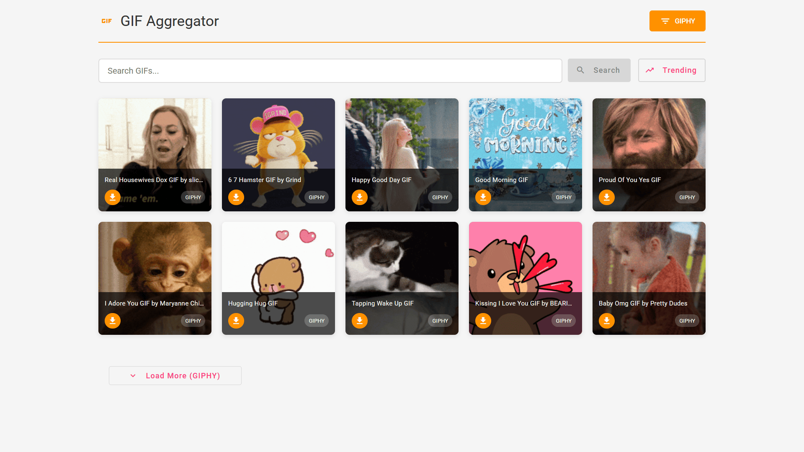
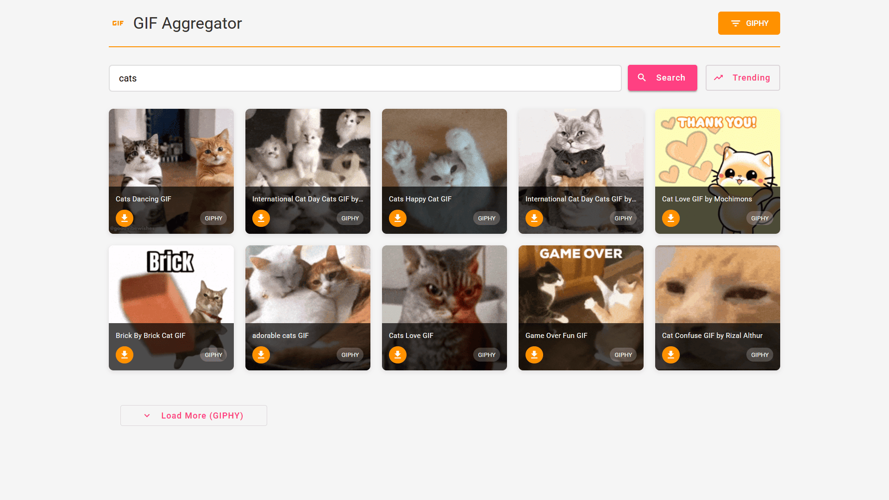

# GIF Aggregator 🎞️

A simple Angular application that aggregates GIFs from multiple providers (GIPHY and KLIPY) into a single unified interface.  
Users can search, view trending GIFs, switch providers, and download GIFs locally.

This project demonstrates clean architecture, provider-based extensibility, and real-world Angular service design.

## Features

- 🔍 Search GIFs across providers
- 📈 View trending GIFs
- 🔄 Switch between providers (GIPHY / KLIPY)
- ⬇️ Download original GIFs
- ♻️ Load more with pagination
- 🎨 Responsive UI using Angular Material
- 🧩 Extensible provider architecture


## Screenshots

| Trending Results | Search Results |
|------------------|----------------|
|  |  |


## Architecture Overview

```plaintext
components/
├── gif-card            → display + download UI
├── provider-selector   → provider switching
└── loading-spinner     → reusable loading UI

core/
├── models              → domain + api models
├── services
│     ├── providers     → GIPHY / KLIPY implementations
│     ├── gif-aggregator.service.ts
│     └── download.service.ts
pages/
└── home                → page-level state & orchestration
```


## Provider Strategy (Key Design)

Each provider implements a common interface:

```ts
interface GifProvider {
  search(query: string, limit: number, offset: number): Observable<GifApiResponse>;
  getTrending(limit: number, offset: number): Observable<GifApiResponse>;
}
```

The **GifAggregatorService** handles:

* Provider registration
* Active provider switching
* Unified search/trending API

This makes adding new providers easy (Tenor, Imgur, etc.) without changing UI logic.


## How to Add a New Provider

1. Implement `GifProvider`
2. Register it in `AppComponent`
3. Done — UI auto-supports it


## Tech Stack

* Angular
* TypeScript
* RxJS
* Angular Material
* GIPHY API
* KLIPY API


## Getting Started

```bash
npm install
ng serve
```

Open: `http://localhost:4200`


## Author

Sharad Chandel
R&D Intern
(Shared with mentor for review & feedback)